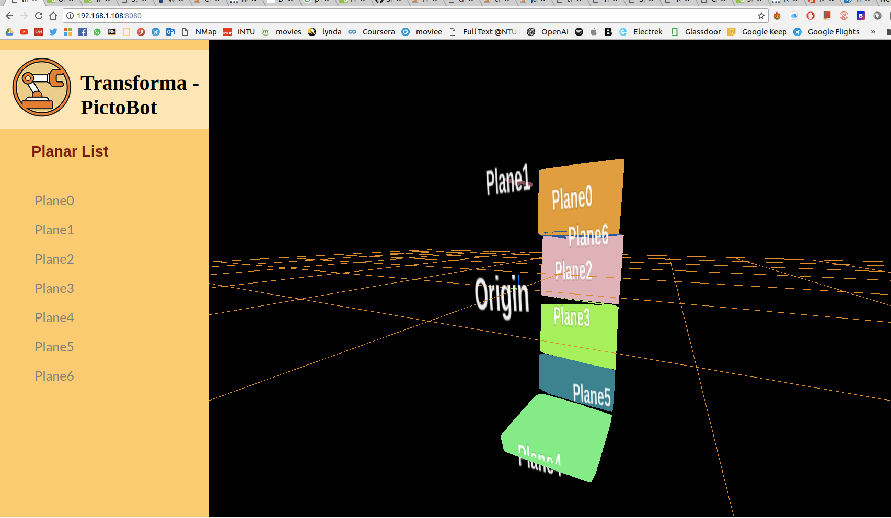

# Web Plane Visualizer

## Introduction

This ROSNodeJS Package is a server based plane visualizer. The main function of this package is to visualized the planar infos of the PictoBot detected planes. 

Basic role of this pakage:
1. Nodejs will act as server, subcriber and publisher of ROS. 
2. The node server will host web clients.
3. User can access respective hosting IP address to communicate with node server
4. Node server will subcribe and publish results to Roscore.
5. ThreeJS Javascript Lib is used to visualized the polygons

* This nodeJs server receive ROS msg from [PCL plane segmentation](https://github.com/tanyouliang95/pcl_indoorPlaneSegmentation). Do run the ros service package `.../ros_pkg_srv` for full implementation.


## Installation

#### 1. Install Node JS

```
curl -sL https://deb.nodesource.com/setup_8.x | sudo -E bash -
sudo apt-get install -y nodejs
nodejs -v
```

* node version needed to be above node v8, or refer here:
 https://www.digitalocean.com/community/tutorials/how-to-install-node-js-on-ubuntu-16-04

* or! for different version, its optional to use [node version manager](https://nodesource.com/blog/installing-node-js-tutorial-using-nvm-on-mac-os-x-and-ubuntu/) to install

#### 2. Install ROS

http://wiki.ros.org/ROS/Installation

* Preferably ROS Kinetic


#### 3. Run ROS and Node

After installation of ROS and Node are completed, user can start to test run the server.

Run Roscore
> roscore

Run server in another terminal
> cd ../WebPlaneVisualizer
> node server.js

By now, user can access the site while enter the respective IP in a web browser. e.g: http:/192.168.1.108:8080/


#### 4. Change of IP address.

if `node server.js` cant be run, the main prob is the IP address of ur device is different to the one in the server.js script. Essentially, User will need to open the `server.js` file, change the ip address to the current device ip address. Enter `ifconfig` to check the IP address of the current device. 

Once done, rerun the above `node server.js`. Then enter the respective address in a web browser.


## Using this package

- Open Web IP in a web browser
- A site will appear with empty 3D scene. 
- Site will remain empty while waiting for ROS msg from a ROSTopic: `/planeBorders`. 
- When ROS Msg is received by the publisher server, the website will visualizer the published plane borders in a 3D scene. 
- User can select the desired plane, and the selection will be sent to the the Robot Task Planner.

**Site is shown here:** 


## File Structure

#### server.js
- node hosting server
- ros publisher and subscriber
- render `indoor_plane-visualizer.html`
- sending of datas to web clients

#### indoor_plane_visualizer.html
- css and html
- call dependended JS lib (cdn) and `../planeVisualizer.js`

#### ../planeVisualizer.js
- main threejs scene generation
- polygons and planes generation of html
- sidebar list and clicks

#### ../three.js
- webgl functionality

## Contact

This package is still in development phase. Contact tan_you_liang@hotmail.com for further updates.
